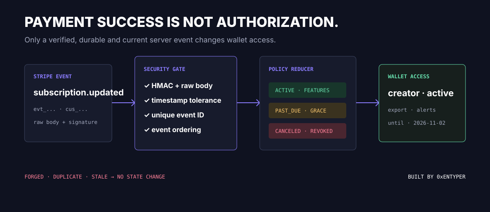
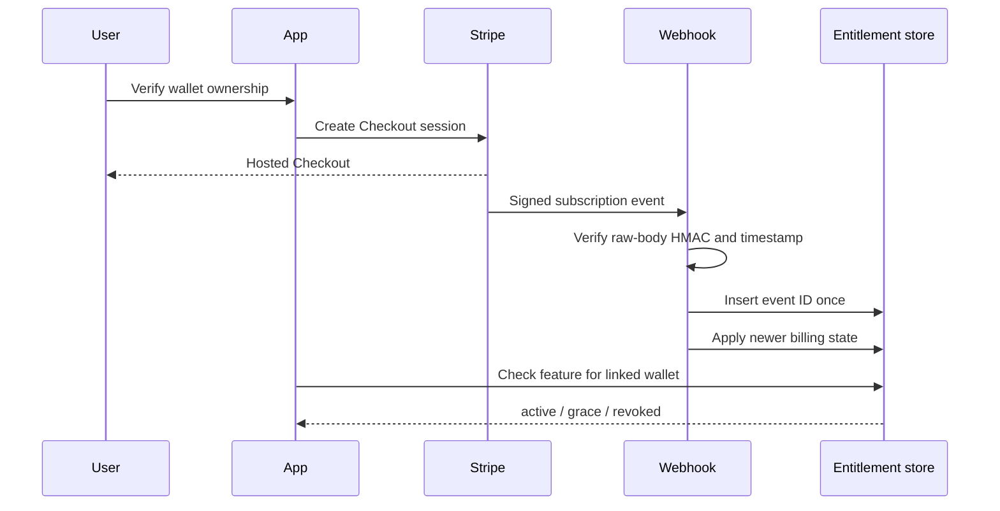
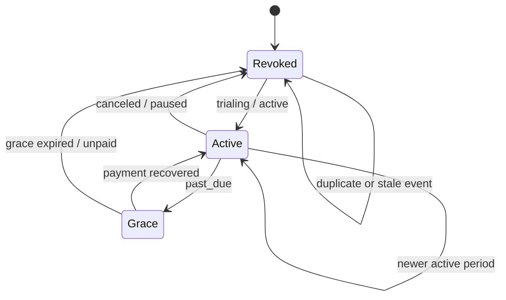

<div align="center">

# Stripe Web3 Entitlements

### A secure billing-to-wallet access layer with replay protection and deterministic entitlement state.

   

[](https://github.com/0xENTYPER/stripe-web3-entitlements/actions/workflows/ci.yml)

</div>

Accepting a payment is only half of a paid product. The harder boundary is reliably translating asynchronous billing state into access for a verified wallet without granting twice, revoking from an old event, or trusting a forged webhook.

This repository demonstrates that boundary as a small executable domain layer. It contains no live Stripe keys, customer records, wallet addresses, product prices, or production application source.



## Trust boundaries

| Input | Trusted when | Never sufficient alone |
| --- | --- | --- |
| Checkout redirect | Never for authorization | A `success` query parameter |
| Stripe webhook | HMAC and timestamp verify | Parsed JSON without raw-body verification |
| Billing event | Newer and idempotently persisted | Delivery order |
| Wallet address | Ownership challenge succeeds | Checkout metadata |
| Feature request | Session, wallet link, and entitlement agree | Client-side plan state |

The architecture connects two identity systems without pretending they are the same: Stripe proves billing state; a signed challenge proves wallet control; the application owns the link between them.

## The workflow



The browser never grants access. Checkout success can improve UX, but only a verified server-side event changes entitlements.

## Threat model

| Risk | Control |
| --- | --- |
| Forged webhook | HMAC-SHA256 verification over Stripe's raw payload |
| Replay outside delivery window | Configurable timestamp tolerance |
| Duplicate delivery | Unique event ID plus idempotent reducer |
| Out-of-order delivery | Older `createdAt` cannot overwrite newer state |
| Unknown price | Fail closed and revoke features |
| Past-due payment | Explicit bounded grace policy |
| Expired entitlement | Feature check evaluates `accessUntil` |
| Customer/wallet mix-up | Customer identity is checked before reduction |
| Secret exposure | Webhook secret remains a runtime secret |

## Webhook verification

[`src/signature.ts`](src/signature.ts) implements the essential Stripe signature shape:

```ts
const signedPayload = `${timestamp}.${rawBody}`;
const expected = HMAC_SHA256(webhookSecret, signedPayload);
```

Important implementation detail: verify the unmodified request body. Parsing and reserializing JSON before verification changes the signed bytes. Multiple `v1` signatures are accepted to support endpoint-secret rotation, and comparison avoids early exit.

In production, the official Stripe SDK is usually the preferred verifier where the target runtime supports it. This dependency-light implementation makes the security boundary visible and testable.

## Entitlement reducer

The billing adapter normalizes Stripe resources into a compact event:

```ts
interface BillingEvent {
  id: string;
  createdAt: number;
  customerId: string;
  subscriptionId: string;
  priceId: string;
  status: SubscriptionStatus;
  validUntil: number | null;
}
```

The reducer in [`src/entitlements.ts`](src/entitlements.ts) is pure and deterministic. That keeps Stripe payload parsing, persistence, and product authorization separate.

### Status policy

| Billing status | Access |
| --- | --- |
| `trialing`, `active` | Active until the normalized item period ends |
| `past_due` | Grace, capped by policy and known validity |
| `paused`, `canceled`, `unpaid`, `incomplete` | Revoked |
| Unknown `priceId` | Revoked |

Stripe API versions can change where billing periods live. The adapter should normalize the active subscription item's period rather than coupling the entitlement reducer to a raw webhook shape.

### Deterministic state machine



Reducer output depends only on current state, the normalized event, and policy. Stripe SDK objects never leak into authorization checks.

## Persistence contract

[`schema.sql`](schema.sql) shows the minimum durable records:

- `stripe_events.event_id` is unique for idempotency;
- `customer_wallets` stores a previously verified one-to-one link;
- `entitlements` stores the latest source event and access decision.

Webhook processing should use a transaction: insert the event ID, lock/read entitlement state, apply the reducer, and persist the new version. A list of recently processed IDs inside the reference state helps tests, but the database uniqueness constraint is the production concurrency control.

### Durable event path

```text
BEGIN
  INSERT stripe_events(event_id)       -- unique replay gate
  SELECT entitlement FOR UPDATE        -- serialize one subject
  APPLY deterministic reducer          -- reject stale createdAt
  UPSERT entitlement + source_event_id -- preserve provenance
COMMIT
```

| Delivery | Persistence result | Authorization result |
| --- | --- | --- |
| First valid event | Insert and reduce | State may change |
| Exact retry | Unique conflict / known event | No-op |
| Older event | Record for audit, reducer rejects overwrite | Latest access remains |
| Unknown price | Persist source, fail closed | Revoked |
| Invalid signature | No database write | No change |

## Wallet-link boundary

This repository starts after wallet ownership is verified. A complete integration should issue a short-lived nonce, bind the expected domain and chain, verify the signed message server-side, consume the nonce exactly once, and only then connect the wallet to the authenticated billing account.

Payment metadata alone is not proof that a user controls a wallet.

## Run it

```bash
npm install
npm run check
npm test
npm run demo
```

The 10 scenarios cover signature verification, secret rotation, replay tolerance, active access, duplicate events, stale delivery, grace periods, unknown prices, expiration, and customer isolation.

## Product and UI rationale

- Display **Plan active until…** instead of a generic success badge.
- Keep billing identity and connected wallet visible as separate facts.
- Give `past_due` users a recoverable state and a direct billing action.
- Explain when access updates are pending webhook confirmation.
- Never expose raw Stripe status names without user-facing copy.
- Keep the billing portal as the place to manage payment methods and cancellation.
- Show revoked access without deleting user-created data.

### User-facing states

| Internal state | Product copy | Primary action |
| --- | --- | --- |
| `active` | Plan active until a concrete date | Manage billing |
| `grace` | Payment needs attention; access remains temporarily | Update payment method |
| `revoked` | Paid feature unavailable; user data preserved | Choose a plan |
| webhook pending | Payment received, access is updating | Refresh status |

This avoids both false success and hostile failure. Billing latency is explained, while the server remains the only authority.

## Integration checklist

1. Pin a Stripe API version and test upgrades.
2. Subscribe only to event types the product actually handles.
3. Store webhook secrets in a managed secret binding.
4. Preserve raw request bytes for signature verification.
5. Return a fast `2xx` after durable processing or queueing.
6. Reconcile from Stripe's current resource when event order is ambiguous.
7. Use idempotency keys for Stripe mutation requests.
8. Alert on repeated webhook failures and growing event lag.

## Repository map

| Path | Responsibility |
| --- | --- |
| [`src/signature.ts`](src/signature.ts) | Raw-body HMAC verification and replay window |
| [`src/entitlements.ts`](src/entitlements.ts) | Pure billing-to-access reducer |
| [`src/model.ts`](src/model.ts) | Normalized event and entitlement contracts |
| [`schema.sql`](schema.sql) | Idempotency, wallet links, durable decisions |
| [`examples/run.ts`](examples/run.ts) | Signed event and access demonstration |
| [`test/entitlements.test.ts`](test/entitlements.test.ts) | Security, ordering, expiry, and isolation cases |

## What this case study demonstrates

- integrating Stripe without treating a payment redirect as authorization;
- designing replay-safe, order-safe webhook processing;
- joining conventional billing identity to verified wallet ownership;
- reducing provider payloads into a stable access policy;
- designing recoverable payment UX while keeping authorization fail-closed.

## References

- [Stripe Events API](https://docs.stripe.com/api/events)
- [Stripe idempotent requests](https://docs.stripe.com/api/idempotent_requests)
- [Stripe subscription webhooks](https://docs.stripe.com/billing/subscriptions/webhooks)
- [Stripe API upgrade guidance](https://docs.stripe.com/upgrades)

## Scope

This is a reference implementation, not PCI guidance or a complete checkout service. It does not create Checkout sessions, verify wallet signatures, persist real customer data, or contain production pricing.

## Related work

- [telegram-miniapp-starter](https://github.com/0xENTYPER/telegram-miniapp-starter) demonstrates the authenticated Telegram surface that can consume entitlements.
- [ElonTracker](https://github.com/0xENTYPER/elon-tracker) provides product context for Stripe-backed paid access and Telegram delivery.
- [Baggy](https://github.com/0xENTYPER/baggy) shows wallet-aware product flows where billing identity and wallet identity remain separate.

## Author

Built by [0xENTYPER](https://github.com/0xENTYPER).
